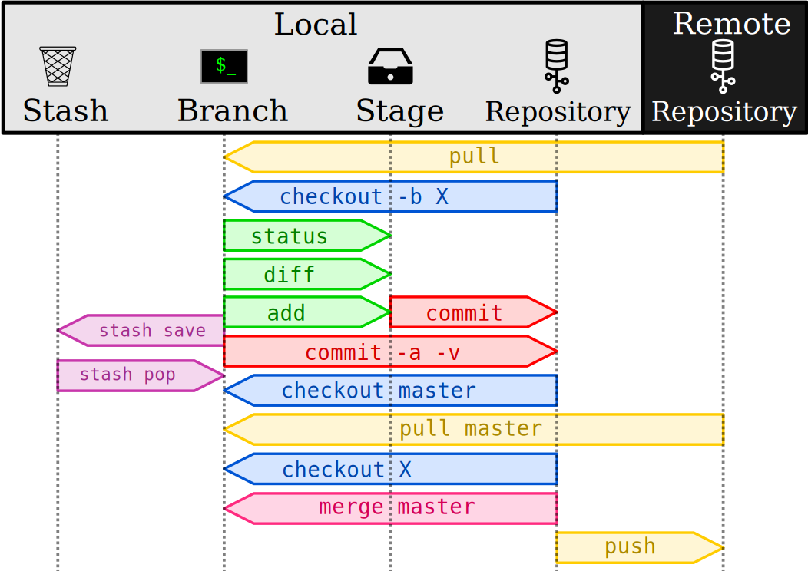

The crux of Git
===============

Git is:
- a backup system
- which targets source code

Git is not:
- a backup repository for large binary files
- homeomorphic endofunctors mapping submanifolds of a Hilbert space

Create a Git repository from scratch:
```sh
mkdir mysoft
cd mysoft
git init
git config user.name "Johann Dreo"
git config user.email johann.dreo@pasteur.fr
```


Basics
======

Commits
-------

A Git *repository* is an history of incremental *commits*.
```sh
git log
echo "My soft" > README.md
git status
git add README.md
git commit
git status
git log
```

Canonic commit message format:
```
<type>[scope]: short title

Summary of changes.
With emphasis on the "why?".

[metadata]
```

Common types: fix, feat, docs, style, refactor, test.

See: https://www.conventionalcommits.org/en/v1.0.0/


Patches
-------

```sh
echo "is awesome!" >> README.md
git status
git diff
git add README.md
git commit -v
git log
```


Branches
--------

```sh
git checkout -b "fix/ortho"
vim README.md
git add README.md
git commit -v
gitk --all .
```


Merge
-----

```sh
git checkout master
git merge fix/ortho
git log
gitk --all .
```


Remotes
=======

Copy of the repository
----------------------

Remote repository are backup of your local one
- elsewhere in your file system,
- on a server somewhere on the network (e.g. via https, ssh),
- hosted by services provider (e.g. github, gitlab)


```sh
cd ..
mkdir myremote
cd myremote
git clone ../mysoft
cd mysfot
gitk --all .
```


pull
----

You can get several commits at once from a remote repository with a `pull`:
```sh
cd ../../mysoft
echo "Check it out." >> README.md
cd ../myremote/mysoft
git pull ../../mysoft
```


Named remotes
-------------

You can give a name to a remote.
```sh
cd ../../mysoft
git remote add there ../myremote/mysoft
git pull there master
```


Remote Servers
==============

If you own a privileged access to a remote on a server (e.g. gitolite on LAN, github or gitlab on internet, etc.), you can backup a set of commits with a `push`.


Workflow summary
================

Classical workflow for working with others:
0. `pull`
1. `checkout -b feat/myfeat`
2. Edit, `status`, `diff`, `commit -a -v`, `stash`.
3. `pull origin master`
4. `checkout master`
5. `merge feat/myfeat`
6. `push`
7. Pull request
    - just send an e-mail, or
    - send a patch, or
    - on the issue tracker.




Nice Git features
=================

- Automatic merge.
- Conflict detections.
- Faulty commit search (see `bisect`).

